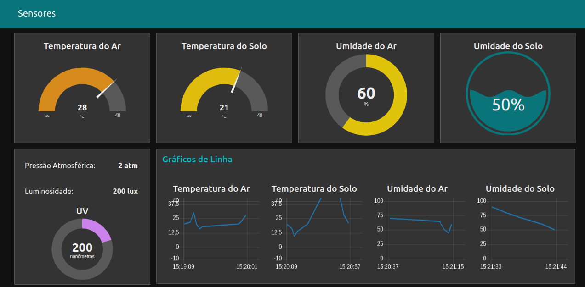
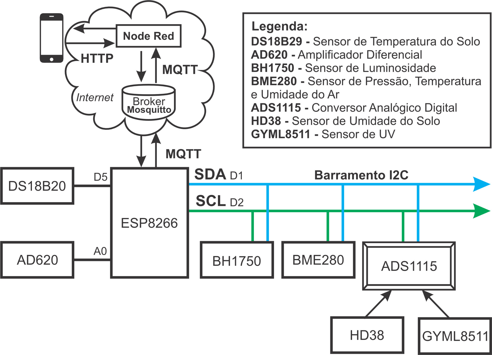
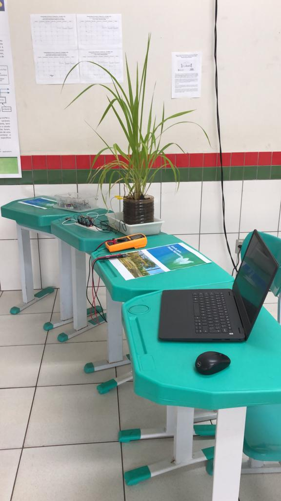

# IFPR-CCPM
O projeto teve como objetivo o desenvolvimento de uma estação meteorológica personalizada e compacta para controle e monitoramento das condições de ar e solo de uma Célula a Combustível Planta-Microbiana (CCPM) por meio da aplicação de tecnologias de Internet das Coisas (IoT).

## Introdução

Uma Célula a Combustível Planta-Microbiana (CCPM) representa um avanço significativo na integração de sistemas bioeletroquímicos e sustentabilidade ambiental. Nesse sistema, bactérias presentes na rizosfera da planta desempenham um papel crucial. Elas oxidam a matéria orgânica gerada durante a fotossíntese e exsudada pelas raízes, liberando elétrons e prótons.

Os elétrons são transferidos por microrganismos para o anodo, percorrendo um circuito externo com uma certa resistência até alcançar o catodo. Enquanto isso, os prótons se deslocam pelo substrato até o catodo, onde ocorre a redução do oxigênio, resultando na geração de água. Esse processo bioeletroquímico oferece a possibilidade de obter energia elétrica limpa e renovável por meio da CCPM. Além disso, contribui para a diminuição da concentração de gases do efeito estufa na atmosfera, já que as plantas capturam e fixam o dióxido de carbono do ar durante a fotossíntese.

A construção de uma estação meteorológica personalizada é fundamental para monitorar as condições ambientais da CCPM. Ao coletar informações precisas, é possível ajustar e controlar as condições visando o aumento da produção de energia elétrica limpa e a redução da concentração de gases do efeito estufa. A estação não apenas amplifica os ganhos ambientais, mas também estabelece uma base sólida para futuras pesquisas e aplicações na área de monitoramento de condições para Células a Combustível Planta-Microbiana, produção de bioeletricidade e experimentos biológicos.

## Etapas para realização do projeto

**Arduino (Abril/Maio de 2023):** Foram realizados estudos e experimentações com a placa Arduino e sua IDE. Testando exemplos relacionados a entradas e saídas, sensores e atuadores, comunicação, temporizadores e interrupções utilizando o Arduino.

**MQTT (Maio/Junho de 2023):** O foco desta etapa foi o estudo teórico e prático do protocolo MQTT (Message Queuing Telemetry Transport) e do broker Mosquitto. Testando exemplos práticos e experimentações com a biblioteca MQTT pubsubclient.h para o Arduino e o ESP8266. Além disso, houve análise do protocolo MQTT com o auxílio do Wireshark, consolidando o entendimento sobre o protocolo MQTT.

**Estudo da Estação Meteorológica (Junho/Julho de 2023):** Na terceira fase, foi estudado o software e o hardware da estação meteorológica já presente no IFPR. Com o objetivo de compreender a estrutura e o funcionamento da estação meteorológica desenvolvida anteriormente, para produção da nova estação com foco no monitoramento da CCPM e integração com as tecnologias de IoT estudadas nas etapas anteriores que não estavam presentes na estação anterior.

**Testes e Implementação da Estação Meteorológica (Julho/Agosto de 2023):** A etapa de testes e implementação resultou na criação da estação meteorológica personalizada. O uso do microcontrolador ESP8266 e a integração com uma variedade de sensores permitiram o monitoramento preciso de temperatura (DS18B29) e umidade do solo (HD38), pressão, temperatura e umidade do ar (BME280), luminosidade (BH1750) e radiação UV (GYML8511) na estufa da CCPM. A comunicação via interface WiFi e o uso do protocolo MQTT garantiram a publicação eficiente dos dados coletados pelos sensores no broker Mosquitto.

**Exploração de Tecnologias Adicionais e Desenvolvimento da Interface (Agosto/Setembro de 2023):** Durante a implementação da estação meteorológica, o estudo se ampliou ao explorar tecnologias adicionais, como o barramento I2C para comunicação do microcontrolador com os sensores digitais e o conversor analógico digital ADS1115 que repassa os dados lidos dos sensores analógicos para o barramento I2C. Além disso, a construção da interface por meio do ambiente de programação low code NodeRED, permitiu o acesso aos dados coletados pelos sensores por meio de um painel de controle acessível pela Web e aplicativo móvel por meio da subscrição ao broker Mosquitto pelo protocolo MQTT.

## Resultados

